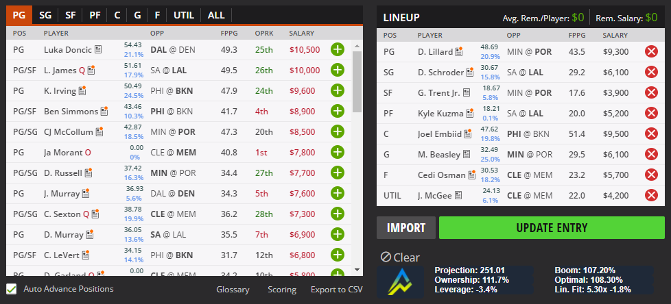
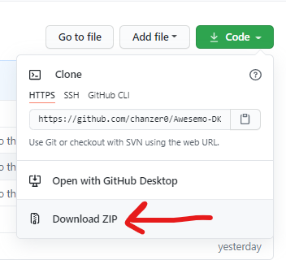
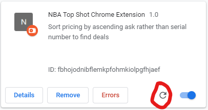
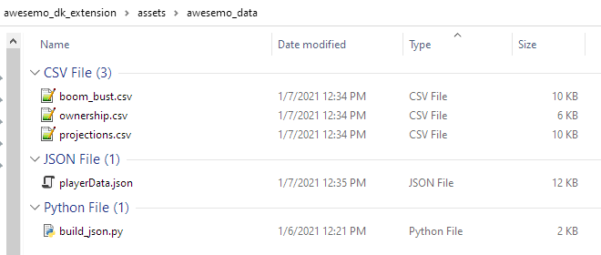
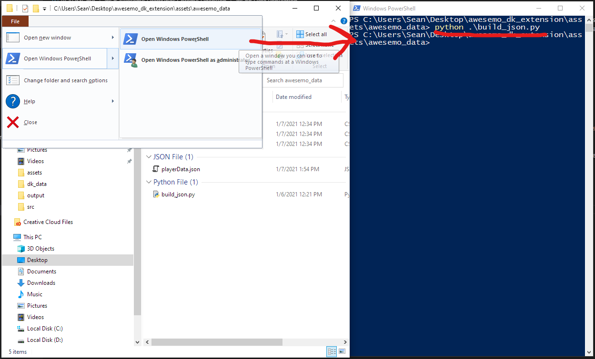

# Awesemo DraftKings Chrome Extension
**NOTE - THIS EXTENSION IS NOT OFFICIALLY ASSOCIATED WITH AWESEMO**

Packaged in this github repository is a tool for Awesemo handbuilders that incorporates Awesemo projections, ownership, boom/bust and optimal percentages into the DraftKings user interface to aid you in handbuilding lineups. Listed below are examples of what the extension looks like, how to install it, and how to populate the data for it.

## Screenshots

## Installation
### System requirements
- To use the extension, you will obviously need to use the Google Chrome web browser
- To generate the data that the extension uses, you will need to [install python](https://www.python.org/downloads/) in order to run `build_json.py`

1. From this github repository, you may either:
    - clone the repository if you are used to git - `git clone https://github.com/chanzer0/Awesemo-DK-Extension.git`
    - download the codebase as a ZIP file (see screenshot below). Extract the zip file to your location of choosing.
    
        

2. Follow the "Data Population" section below to import Awesemo data and generate the file used by the browser
3. Once you have generated the data, navigate to `chrome://extensions/` in your Google Chrome web browser
4. In the top left, select `Load Unpacked` and navigate to the directory of the code you downloaded in step 1.
5. You should now see an extension like the one below. You can ignore the "Errors" tab. Click the refresh button, and then navigate to a draftkings draft lobby and test it out!
    
6. You will have to follow steps 4 and 5 each time you update `playerData.json` and want those effects to take place in-browser 
7. If you experience issues where data/numbers aren't showing up, a simple click anywhere on the screen should trigger changes, and should fix the problem. If you run into issues beyond this, feel free to leave an issue [here](https://github.com/chanzer0/Awesemo-DK-Extension/issues) and I will address it.

## Data Population
To begin with, navigate to `Awesemo-DK-Extension\assets\awesemo_data`. Download the projections, ownership and boom/bust tools as CSV from Awesemo and bring them into the directory. It should look like the screenshot below (not having `playerData.json` is okay, we will be generating that here), you will have to rename the files as they appear below.

Then, in the same working directory, open a windows console (or Powershell). You will then execute `python .\build_json.py` as seen below. This generates a new `playerData.json` file, which is what the extension uses to pull data onto the webpage.

Anytime there is an update in projections, you will have to repeat the processes above to generate new data based on the updated projections.
